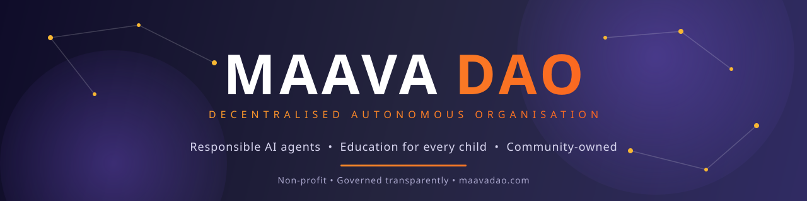

<div align="center">



### Community-Governed AI & Blockchain Technologies for Education

[](https://maavadao.com)&nbsp;&nbsp;
[](https://www.apache.org/licenses/LICENSE-2.0)&nbsp;&nbsp;
[](#governance)&nbsp;&nbsp;
[](#contributing)&nbsp;&nbsp;
[](https://github.com/maavadao)

</div>

**Build it. Own it. Share it.** Free for everyone, with a share of every success going to children who need it most.

maavaDao brings together agentic AI and blockchain technologies to create an open,
community-owned ecosystem for education. **Developers build and list AI agents on the maava
Marketplace. Educators, students and content creators use them to teach, learn, research and
inform.** There are no listing fees, no creation fees and no commissions. When a product earns
money, **75% goes to the community who built it and 25% goes to maava** to educate deserving
children, orphans and street children.

> 🌱 **Early stage.** We are looking for founding contributors, education partners and pilot communities. [Get involved ↓](#contributing)

<details>
<summary><b>How it works</b></summary>
<br>

1. **Create and list, free.** Anyone can build an AI agent and list it on the maava Marketplace, free, always.
2. **Propose a project.** Any community member can propose a new product, such as an AI science tutor or a research agent for content creators.
3. **The DAO votes.** The community votes on proposals, and approved projects get the backing of the community.
4. **Build together.** Developers, educators, designers, translators and subject experts contribute. Every contribution is recorded transparently on the blockchain.
5. **Share the rewards.** When a product is monetised, revenue is split automatically: 75% to community contributors, 25% to maava, to educate deserving children, orphans and street children.

</details>

<details>
<summary><b>Key features</b></summary>
<br>

- **Open agent marketplace.** List and share agents for free. No listing fees, no creation fees and no commissions.
- **Automatic revenue sharing.** The 75/25 split is enforced in code, not left to promises.
- **Blockchain-linked agents.** Each agent has an on-chain identity recording its author, version history, review status and usage.
- **Shared ownership.** Contributors become co-owners of the platform with a voice in its direction.
- **Multi-level governance.** Decisions are made as close as possible to the people they affect.
- **Built for low-resource settings.** Agents work on low-cost devices, with limited bandwidth, and in local languages wherever possible.

</details>

<details id="governance">
<summary><b>Governance</b></summary>
<br>

maavaDao combines DAO principles with AI to create a platform where accountability is built in, not bolted on.

| Level | Who takes part | What they decide |
|---|---|---|
| **Local** | Schools, orphanages, teachers, parents, local organisations | Which agents are used locally, local content and language needs, how local rewards are allocated |
| **Country** | National chapters, education partners, regional contributors | Country-specific safety and curriculum standards, compliance with national law, regional priorities |
| **Community (global)** | All contributors and members | Platform-wide standards, responsible AI policy, treasury and reward rules, roadmap |

Proposals, votes and outcomes are recorded on-chain so that every decision can be traced and audited.

</details>

<details>
<summary><b>Responsible AI and safeguarding</b></summary>
<br>

Because this platform serves children and young people, safety comes first.

- **Safeguarding by design.** Agents used with children must meet maavaDao's safeguarding and content standards before listing.
- **Privacy.** Learners' data, especially children's, is minimised, protected and never sold.
- **Accuracy.** Educational content, especially in subjects like medicine, is reviewed by qualified educators or experts.
- **Responsible content.** Agents used for content creation must support accurate, informative and respectful publishing.
- **Inclusion.** Agents should work across languages, abilities, low-cost devices and low-bandwidth connections.

</details>

<details>
<summary><b>Who it is for</b></summary>
<br>

- **AI developers** who list agents for free on the maava Marketplace, contribute to community projects, and earn from what they help build.
- **Content creators** who use maava agents to research freely, create informative and educational content, and publish it.
- **Schools, colleges and universities** who access AI agents for teaching, tutoring, assessment and learner support.
- **Teachers and student teachers** who use agents to plan lessons, create materials and support every learner.
- **Students** who learn with AI tutors and study tools in any subject, at their own pace.

</details>

<details>
<summary><b>Impact: maava schools</b></summary>
<br>

maava is already running **two schools for deserving children**. maavaDao extends that mission
into the age of AI. We are now setting up **Maava School for AI**, giving deserving children,
orphans and street children the skills to learn with, use and build AI. Every product
monetised on maavaDao helps fund this work.

</details>

<details>
<summary><b>Architecture overview</b></summary>
<br>

```
┌──────────────────────────────────────────────────────────┐
│                      User Interfaces                     │
│     Web marketplace  ·  Mobile/low-bandwidth app  ·  API │
└──────────────────────────────┬───────────────────────────┘
                               │
┌──────────────────────────────▼───────────────────────────┐
│                     Agent Marketplace                    │
│   Listing · Discovery · Review workflow · Safety checks  │
└──────────────┬───────────────────────────────┬───────────┘
               │                               │
┌──────────────▼──────────────┐ ┌──────────────▼───────────┐
│        Agent Runtime        │ │     Blockchain Layer     │
│  Sandboxed execution        │ │  Agent identity registry │
│  Content filtering          │ │  Contribution records    │
│  Usage metering (no PII)    │ │  Reward smart contracts  │
└─────────────────────────────┘ │  DAO governance & voting │
                                └──────────────────────────┘
```

</details>

<details>
<summary><b>Roadmap</b></summary>
<br>

- [ ] **Phase 1: Foundation.** Open-source repository, contributor guidelines and safeguarding standards
- [ ] **Phase 2: maava Marketplace.** Free agent listing and discovery for educators, students and content creators
- [ ] **Phase 3: DAO governance.** Project proposals and community voting at local, country and community level
- [ ] **Phase 4: Maava School for AI.** AI education for deserving children, building on maava's two existing schools
- [ ] **Phase 5: Community token.** Launch of the maavaDao token

</details>

### Contributing

There are many ways to contribute, and not all of them involve code: build or improve AI agents for education and content creation · propose a project for the DAO to vote on · review agents for safety, quality and bias · translate agents and learning content into local languages · improve documentation · connect schools, colleges and communities to the platform · take part in governance.

**Want in?** ⭐ Star & watch → [visit maavadao.com](https://maavadao.com) → pick an issue → start building.


